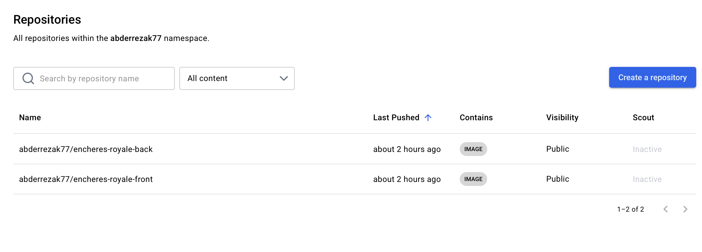
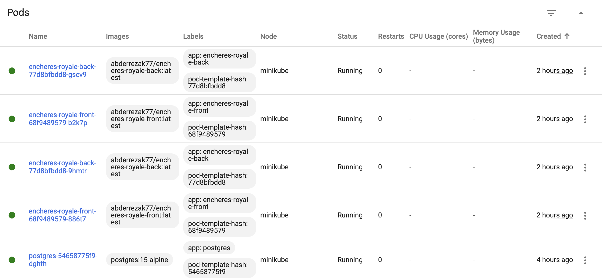
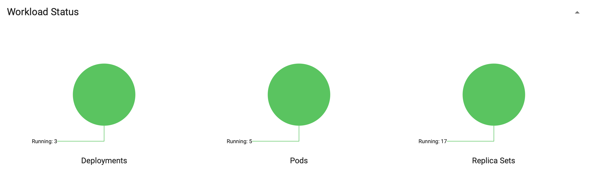
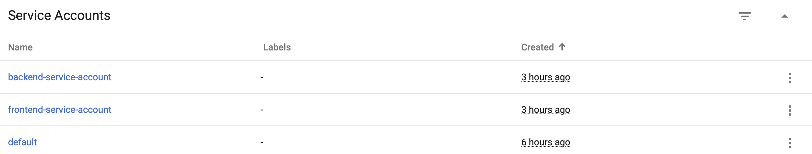
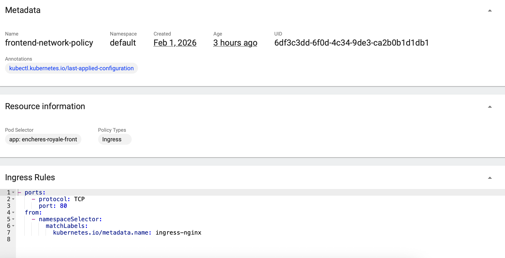
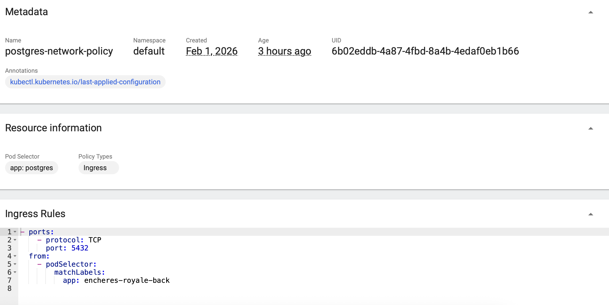
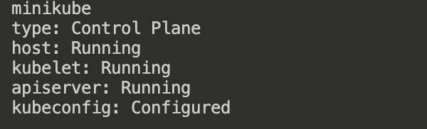
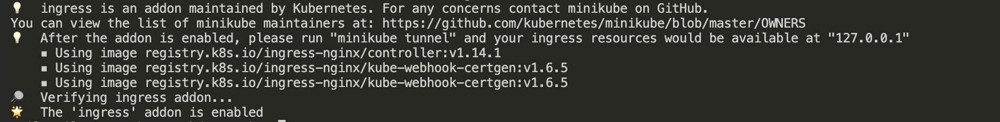
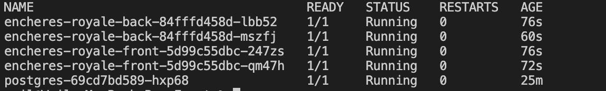
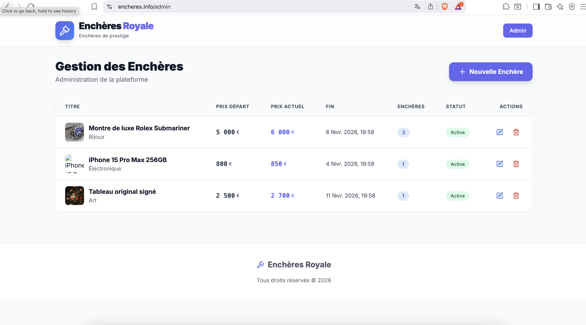

# Enchères Royale - Plateforme d'Enchères en Temps Réel

## Table des Matières

1. [Vue d'ensemble](#vue-densemble)
2. [Architecture du Projet](#architecture-du-projet)
3. [Technologies Utilisées](#technologies-utilisées)
4. [Aspects Implémentés](#aspects-implémentés)
5. [Sécurité Kubernetes](#sécurité-kubernetes)
6. [Déploiement Multi-Environnement](#deploiement-multi-environnement)
7. [Guide de Test - Environnement Local](#guide-de-test---environnement-local)
8. [Accès à l'Application en Production](#accès-à-lapplication-en-production)

---

##  Vue d'ensemble

**Auteurs**
- Abderrezak SAADI
- Maroua Boufenissa
- Abderrahim AROUS

Université de Paris cité
M2G1 MIAGE
Année universitaire 2025-2026


**Enchères Royale** est une plateforme web d'enchères en ligne, construite avec une architecture microservices conteneurisée et déployée sur Kubernetes. Le projet démontre l'utilisation de Docker, Kubernetes, et des pratiques DevOps incluant la sécurité, l'orchestration de conteneurs, et le déploiement cloud.

### Fonctionnalités Principales

-  Navigation et recherche de produits aux enchères
-  Système d'enchères en temps réel
-  Interface d'administration pour la gestion des produits
-  Connexion HTTPS sécurisée (Let's Encrypt)
-  Interface utilisateur responsive et moderne
-  Base de données PostgreSQL persistante

---

##  Architecture du Projet

### Architecture Microservices

```
┌────────────────────────────────────────────────────────────────────┐
│                        KUBERNETES CLUSTER                          │
│                                                                    │
│  ┌─────────────────┐              ┌─────────────────┐            │
│  │  Ingress Nginx  │              │  Ingress Nginx  │            │
│  │     (Local)     │              │     (Azure)     │            │
│  │                 │              │                 │            │
│  │ encheres.info   │              │ encheres-app... │            │
│  │ :80, :443       │              │ :80, :443       │            │
│  └────────┬────────┘              └────────┬────────┘            │
│           │                                │                     │
│           └──────────────┬─────────────────┘                     │
│                          │                                       │
│                   Routes vers                                    │
│              ┌────────────┴────────────┐                         │
│              │                         │                         │
│    ┌─────────▼──────────┐    ┌────────▼────────┐               │
│    │  front-service     │    │  back-service   │               │
│    │  (LoadBalancer)    │    │  (ClusterIP)    │               │
│    │  Port: 80          │    │  Port: 80       │               │
│    └─────────┬──────────┘    └────────┬────────┘               │
│              │                         │                         │
│      ┌───────┴────────┐        ┌──────┴──────┐                 │
│      │                │        │             │                  │
│  ┌───▼────┐      ┌───▼────┐  ┌▼─────┐  ┌───▼─────┐            │
│  │Frontend│      │Frontend│  │Backend│  │Backend  │            │
│  │ Pod 1  │      │ Pod 2  │  │ Pod 1 │  │ Pod 2   │            │
│  │        │      │        │  │       │  │         │            │
│  │ Nginx  │      │ Nginx  │  │Node.js│  │Node.js  │            │
│  │ React  │      │ React  │  │Express│  │Express  │            │
│  │ :80    │      │ :80    │  │:3001  │  │:3001    │            │
│  └────────┘      └────────┘  └───┬───┘  └────┬────┘            │
│                                  │           │                  │
│                                  └─────┬─────┘                  │
│                                        │                        │
│                              ┌─────────▼──────────┐             │
│                              │ postgres-service   │             │
│                              │   (ClusterIP)      │             │
│                              │   Port: 5432       │             │
│                              └─────────┬──────────┘             │
│                                        │                        │
│                                  ┌─────▼──────┐                 │
│                                  │ PostgreSQL │                 │
│                                  │    Pod     │                 │
│                                  │            │                 │
│                                  │ Postgres15 │                 │
│                                  │  + PV/PVC  │                 │
│                                  │   :5432    │                 │
│                                  └────────────┘                 │
│                                                                  │
└──────────────────────────────────────────────────────────────────┘

Flux de requête utilisateur :
1. Utilisateur → Ingress (encheres.info ou encheres-app...)
2. Ingress → front-service → Frontend Pod (1 ou 2)
3. Frontend Nginx proxy /api → back-service → Backend Pod (1 ou 2)
4. Backend Pod → postgres-service → PostgreSQL Pod
```


### Structure des Composants

| Composant           | Technologie              | Rôle                    | Replicas |
| ------------------- | ------------------------ | ----------------------- | -------- |
| **Frontend**        | React + Vite + Nginx     | Interface utilisateur   | 2        |
| **Backend**         | Node.js + Express        | API REST                | 2        |
| **Base de données** | PostgreSQL 15            | Persistance des données | 1        |
| **Ingress**         | Nginx Ingress Controller | Routage HTTP/HTTPS      | 1        |

---

##  Technologies Utilisées

### Frontend

- **React 18** - Framework UI
- **Vite** - Build tool moderne et rapide
- **TypeScript** - Typage statique
- **Nginx** - Serveur web pour les fichiers statiques
- **Proxy API** - Routage `/api` vers le backend

### Backend

- **Node.js 20** - Runtime JavaScript
- **Express** - Framework web
- **PostgreSQL Driver (pg)** - Connexion base de données
- **CORS** - Gestion des requêtes cross-origin

### Base de Données

- **PostgreSQL 15** - Base relationnelle
- **Persistent Volume** - Stockage persistant Kubernetes

### Infrastructure & DevOps

- **Docker** - Conteneurisation
- **Docker Hub** - Registry d'images
- **Kubernetes** - Orchestration de conteneurs
- **Minikube** - Cluster Kubernetes local
- **Azure AKS** - Kubernetes managé (cloud)
- **cert-manager** - Gestion automatique des certificats SSL/TLS
- **Let's Encrypt** - Certificats SSL gratuits
- **mkcert** - Certificats SSL locaux

---

## Aspects Implémentés

### 1.  Conteneurisation Docker

**Frontend Dockerfile** :

- Build multi-stage pour optimiser la taille d'image
- Nginx configuré pour servir les fichiers statiques
- Proxy inverse pour les requêtes API
- Compression gzip activée
- Cache des assets statiques

**Backend Dockerfile** :

- Image Node.js Alpine (légère)
- Installation des dépendances en production uniquement
- Healthcheck HTTP intégré
- Variables d'environnement pour la configuration

**Images publiées** :

- `abderrezak77/encheres-royale-front:latest`
- `abderrezak77/encheres-royale-back:latest`

<p align="center">
  
</p>

---

### 2.  Orchestration Kubernetes

#### Deployments

- **Haute disponibilité** : 2 replicas pour frontend et backend
- **Rolling updates** : Déploiement sans interruption
- **Restart policy** : Always
- **Resource limits** : Gestion des ressources CPU/mémoire

#### Services

- **Frontend** : LoadBalancer (exposition externe)
- **Backend** : ClusterIP (interne uniquement)
- **PostgreSQL** : ClusterIP (accès backend seulement)

#### Ingress

- **Nginx Ingress Controller** pour le routage
- **Path-based routing** : Routes vers les services appropriés
- **TLS/SSL** : Terminaison HTTPS au niveau de l'Ingress

#### Storage

- **PersistentVolumeClaim (PVC)** : 1Gi pour PostgreSQL
- **PGDATA** : Sous-répertoire pour éviter les conflits avec `lost+found`

#### Schémas Kubernetes

<p align="center">
  
</p>

<p align="center">
  
</p>

<p align="center">
  
</p>

<p align="center">
  
</p>

---

###   Sécurité Kubernetes

#### RBAC (Role-Based Access Control)

**ServiceAccounts** :

- `backend-service-account` - Accès limité pour le backend
- `frontend-service-account` - Accès minimal pour le frontend

**Roles** :

```yaml
# Backend : accès aux secrets PostgreSQL et services
- apiGroups: [""]
  resources: ["secrets"]
  verbs: ["get"]

# Frontend : accès aux ConfigMaps uniquement
- apiGroups: [""]
  resources: ["configmaps"]
  verbs: ["get", "list"]
```

<p align="center">
  
</p>

#### Network Policies

**Isolation réseau** :

- Backend accessible uniquement par le frontend et l'Ingress
- PostgreSQL accessible uniquement par le backend
- Frontend accessible uniquement par l'Ingress
- Trafic par défaut : DENY

```yaml
# Exemple : Backend Network Policy
ingress:
  - from:
      - podSelector:
          matchLabels:
            app: encheres-royale-front
  - from:
      - namespaceSelector:
          matchLabels:
            name: ingress-nginx
```

<p align="center">
  
</p>
<p align="center">
  
</p>
<p align="center">
  
</p>

#### Pod Security Standards

**Security Context** appliqué :

- `runAsNonRoot: true` - Interdiction d'exécution en root
- `runAsUser: 1000` - UID non-privilégié
- `fsGroup: 1000` - Permissions de groupe
- `readOnlyRootFilesystem` - Système de fichiers en lecture seule (où applicable)

#### Registry Security

- **Docker Hub** comme registry privé
- **imagePullSecrets** configuré pour l'authentification
- Images scannées pour les vulnérabilités

---

<a id="deploiement-multi-environnement"></a>

### 4.  Déploiement Multi-Environnement

#### Environnement Local (Minikube)

**Configuration** :

- Cluster Kubernetes local
- Certificats SSL avec **mkcert** (auto-signés de confiance)
- Accès via `https://encheres.info/`
- Tunnel Minikube pour exposition des services

**Avantages** :

-  Développement et tests en local
-  Pas de coûts cloud
-  Cycle de développement rapide

#### Environnement Cloud (Azure AKS)

**Configuration** :

- Cluster AKS avec 2 nœuds `Standard_B2s_v2`
- Certificats SSL via **Let's Encrypt** (gratuit)
- DNS Azure : `encheres-app.francecentral.cloudapp.azure.com`
- Ingress Controller Nginx

**Avantages** :

-  Haute disponibilité
-  Scalabilité automatique
-  Certificats SSL valides publiquement
-  Accessible depuis internet

| Critère     | Local (Minikube)          | Cloud (Azure AKS)                                     |
| ----------- | ------------------------- | ----------------------------------------------------- |
| **Cluster** | Minikube (1 nœud)         | AKS (2 nœuds Standard_B2s_v2)                         |
| **URL**     | https://encheres.info     | https://encheres-app.francecentral.cloudapp.azure.com |
| **SSL/TLS** | mkcert (certificat local) | Let's Encrypt (certificat public)                     |
| **Coût**    | Gratuit                   | Crédits Azure / abonnement                            |
| **Accès**   | Machine locale + tunnel   | Internet public                                       |
| **Usage**   | Dev, tests                | Production, démo                                      |

---

### 5.  HTTPS & Certificats SSL/TLS

#### Local : mkcert

**Fonctionnement** :

1. Installation d'une autorité de certification (CA) locale
2. Génération de certificats de confiance pour `encheres.info`
3. Aucun avertissement de sécurité dans le navigateur

```bash
mkcert encheres.info localhost 127.0.0.1
# Génère : encheres.info+2.pem et encheres.info+2-key.pem
```

#### Production : Let's Encrypt + cert-manager

**Fonctionnement** :

1. **cert-manager** installé dans le cluster
2. **ClusterIssuer** configuré pour Let's Encrypt
3. Ingress annoté avec `cert-manager.io/cluster-issuer`
4. Validation automatique via challenge HTTP-01
5. Renouvellement automatique tous les 90 jours

```yaml
annotations:
  cert-manager.io/cluster-issuer: "letsencrypt-prod"
tls:
  - hosts:
      - encheres-app.francecentral.cloudapp.azure.com
    secretName: encheres-tls-secret
```

---

##  Guide de Test - Environnement Local

### Prérequis

Avant de commencer, installez **Docker**, **kubectl** et **Minikube** selon votre système :

| Outil        | macOS                                                                                            | Windows                                                                                                    | Linux                                                                                                                                                            |
| ------------ | ------------------------------------------------------------------------------------------------ | ---------------------------------------------------------------------------------------------------------- | ---------------------------------------------------------------------------------------------------------------------------------------------------------------- |
| **Docker**   | [Docker Desktop](https://docs.docker.com/desktop/install/mac-install/)                           | [Docker Desktop](https://docs.docker.com/desktop/install/windows-install/) (WSL2 recommandé)               | [Docker Engine](https://docs.docker.com/engine/install/)                                                                                                         |
| **kubectl**  | `brew install kubectl` ou [guide](https://kubernetes.io/docs/tasks/tools/install-kubectl-macos/) | `choco install kubernetes-cli` ou [guide](https://kubernetes.io/docs/tasks/tools/install-kubectl-windows/) | `sudo apt install kubectl` (Debian/Ubuntu) ou [guide](https://kubernetes.io/docs/tasks/tools/install-kubectl-linux/)                                             |
| **Minikube** | `brew install minikube` ou [guide](https://minikube.sigs.k8s.io/docs/start/)                     | `choco install minikube` ou [guide](https://minikube.sigs.k8s.io/docs/start/)                              | `curl -LO https://storage.googleapis.com/minikube/releases/latest/minikube-linux-amd64 && sudo install ...` ou [guide](https://minikube.sigs.k8s.io/docs/start/) |

- **macOS** : [Homebrew](https://brew.sh/) pour simplifier les installations.
- **Windows** : [Chocolatey](https://chocolatey.org/install) en option, ou téléchargements manuels. Préférer **PowerShell** ou **WSL2** pour les commandes.
- **Linux** : selon la distribution (`apt`, `dnf`, etc.) — voir les liens ci-dessus.

---

### Étape 1 : Ouvrir le projet

```bash
cd encheres-royale
```

---

### Étape 2 : Démarrer Minikube

```bash
# Démarrer Minikube
# macOS / Linux : driver Docker
minikube start --driver=docker

# Windows (PowerShell / CMD) : driver Docker (avec Docker Desktop) ou hyperv
# minikube start --driver=docker
# minikube start --driver=hyperv   # si Hyper-V est activé

# Vérifier que le cluster est démarré
minikube status

# Activer l'addon Ingress
minikube addons enable ingress
```

**Attendez 1-2 minutes** que l'Ingress Controller soit prêt.

<p align="center">
  
</p>

<p align="center">
  
</p>

---

### Étape 3 : Configurer le fichier hosts (résolution DNS locale)

**Indispensable** : sans `127.0.0.1 encheres.info`, l’accès à l’app (étape 9 avec `minikube tunnel`) ne fonctionnera pas.

| OS                | Fichier                                 | Commande / Action                                                          |
| ----------------- | --------------------------------------- | -------------------------------------------------------------------------- |
| **macOS / Linux** | `/etc/hosts`                            | `echo "127.0.0.1 encheres.info" \| sudo tee -a /etc/hosts`                 |
| **Windows**       | `C:\Windows\System32\drivers\etc\hosts` | Ouvrir en **Administrateur**, ajouter la ligne : `127.0.0.1 encheres.info` |

**Vérification** : `ping encheres.info` doit répondre depuis 127.0.0.1.

---

### Étape 4 : Déployer PostgreSQL

```bash
# Déployer la base de données
kubectl apply -f Back/postgres-deployment.yaml

# Vérifier que le pod est en cours d'exécution (peut prendre 30s)
kubectl get pods -l app=postgres

# Attendre que le status soit "Running"
kubectl wait --for=condition=ready pod -l app=postgres --timeout=120s
```

---

### Étape 5 : Initialiser la Base de Données

**macOS / Linux (bash) :**

```bash
kubectl exec -i $(kubectl get pod -l app=postgres -o jsonpath='{.items[0].metadata.name}') \
  -- psql -U postgres -d encheres_royale < Back/database.sql
```

**Windows (PowerShell) :**

```powershell
$pod = kubectl get pod -l app=postgres -o jsonpath='{.items[0].metadata.name}'
Get-Content Back\database.sql | kubectl exec -i $pod -- psql -U postgres -d encheres_royale
```

**Windows (WSL2 / Git Bash) :** même commande que macOS/Linux.

**Résultat attendu** : messages `INSERT 0 X` confirmant l’insertion des données.

---

### Étape 6 : Déployer le Backend

```bash
# Déployer le backend
kubectl apply -f Back/deployment.yaml

# Vérifier le déploiement
kubectl get pods -l app=encheres-royale-back

# Vérifier les logs (doit afficher "PostgreSQL connected successfully")
kubectl logs -l app=encheres-royale-back --tail=20
```

---

### Étape 7 : Déployer le Frontend

```bash
# Déployer le frontend
kubectl apply -f Front/deployment.yaml

# Vérifier le déploiement
kubectl get pods -l app=encheres-royale-front
```

---

### Étape 8 : Configurer HTTPS (Optionnel)

Installe **mkcert** et génère des certificats sur votre machine.

**Installer mkcert**

| OS          | Commande / Lien                                                                                                                                                      |
| ----------- | -------------------------------------------------------------------------------------------------------------------------------------------------------------------- |
| **macOS**   | `brew install mkcert`                                                                                                                                                |
| **Windows** | `choco install mkcert` ou [Releases mkcert](https://github.com/FiloSottile/mkcert/releases)                                                                          |
| **Linux**   | `sudo apt install libnss3-tools` puis `curl -JLO ... mkcert-v*-linux-amd64` et `chmod +x mkcert` (voir [mkcert](https://github.com/FiloSottile/mkcert#installation)) |

**Installer le CA local et générer les certificats**

```bash
# Une seule fois : installer le CA local (demande mot de passe admin/sudo)
mkcert -install

# Générer certificat pour encheres.info (écrase les anciens dans k8s-security/certs/)
cd k8s-security/certs
mkcert encheres.info localhost 127.0.0.1
cd ../..
```

**Créer le Secret TLS**

```bash
kubectl create secret tls encheres-local-tls \
  --cert=k8s-security/certs/encheres.info+2.pem \
  --key=k8s-security/certs/encheres.info+2-key.pem
```

---

#### Appliquer l'Ingress HTTPS

Applique l’Ingress :

```bash
kubectl apply -f Front/ingress.yml
```

---

### Étape 9 : Exposer l’application et y accéder

**Une seule méthode, valable pour Mac, Windows et Linux :**

**1. Vérifier le fichier hosts** (déjà fait à l’étape 3) : il doit contenir `127.0.0.1 encheres.info`. **Sans ça, l’accès ne fonctionnera pas.**

**2. Lancer le tunnel Minikube** (dans un **nouveau terminal**, à laisser ouvert) :

```bash
minikube tunnel
```

Ce terminal doit rester ouvert. La commande peut demander le mot de passe (sudo).

**3. Ouvrir l’application dans le navigateur :**

- **https://encheres.info/** (ou **http://encheres.info/**)

(Accepter l'avertissement de certificat si  mkcert n'es pas configuré.)

---

### Étape 10 : Appliquer les Politiques de Sécurité (Optionnel)

```bash
# RBAC
kubectl apply -f k8s-security/rbac.yaml

# Network Policies
kubectl apply -f k8s-security/network-policies.yaml
```

---

###  Vérification Finale

```bash
# Vérifier tous les pods
kubectl get pods

# Résultat attendu :
# encheres-royale-back-xxx    1/1  Running
# encheres-royale-back-xxx    1/1  Running
# encheres-royale-front-xxx   1/1  Running
# encheres-royale-front-xxx   1/1  Running
# postgres-xxx                1/1  Running

# Vérifier l'Ingress
kubectl get ingress

# Résultat attendu :
# NAME                      HOSTS           ADDRESS        PORTS
# encheres-royale-ingress   encheres.info   192.168.49.2   80,443
```

<p align="center">
  
</p>

---

###  Accéder à l'Application

Ouvrez votre navigateur et accédez à :

- **HTTPS** (si mkcert installé) : **https://encheres.info/**
- **HTTP** (sinon) : **http://encheres.info/**

**Pages disponibles** :

- **Accueil** : `https://encheres.info/`
- **Page produit** : `https://encheres.info/product/1`
- **Admin** : `https://encheres.info/admin`

<p align="center">
  
</p>

<p align="center">
  
</p>

<p align="center">
  
</p>

---

###  Nettoyage (Après les Tests)

```bash
# Supprimer tous les déploiements
kubectl delete -f Front/deployment.yaml
kubectl delete -f Back/deployment.yaml
kubectl delete -f Back/postgres-deployment.yaml
kubectl delete -f Front/ingress.yml

# Arrêter Minikube
minikube stop

# (Optionnel) Supprimer complètement le cluster
minikube delete
```

---

##  Accès à l'Application en Production

### URL Production Azure

L'application est déployée sur **Azure Kubernetes Service (AKS)** et accessible publiquement :

 **https://encheres-app.francecentral.cloudapp.azure.com/**

### Caractéristiques de la Production

| Aspect                  | Détails                                   |
| ----------------------- | ----------------------------------------- |
| **Cloud Provider**      | Microsoft Azure                           |
| **Service**             | Azure Kubernetes Service (AKS)            |
| **Région**              | France Central                            |
| **Nœuds**               | 2x Standard_B2s_v2                        |
| **SSL/TLS**             | Let's Encrypt (renouvelé automatiquement) |
| **Haute disponibilité** | Frontend (2 pods) + Backend (2 pods)      |
| **Base de données**     | PostgreSQL avec stockage persistant Azure |

|

<p align="center">
  
</p>
